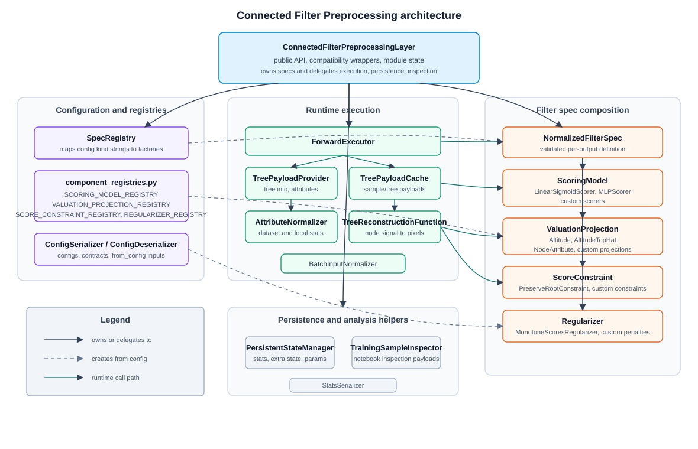

# CFP Architecture

This standalone developer note is intentionally kept outside the Sphinx
documentation tree. It documents internal CFP design and extension contracts
without making them part of the official user-facing documentation site.

This page documents the developer-facing design of
`ConnectedFilterPreprocessingLayer` and the extension points under
`mtlearn.layers.cfp`.

For scoring-specific details, see [CFP Scoring Design](cfp-scoring-design.md).
For score-constraint-specific details, see
[CFP Score Constraint Design](cfp-score-constraint-design.md).
For regularization-specific details, see
[CFP Regularization Design](cfp-regularization-design.md).

The public user import remains:

```python
from mtlearn.layers import ConnectedFilterPreprocessingLayer
```

The implementation lives in `mtlearn.layers.cfp`. The old
`mtlearn.layers.ConnectedFilterPreprocessingLayer` module is a compatibility
shim and should stay importable.

## Design Goals

The CFP layer is organized so these concerns can evolve independently:

- tree construction and dense tree tensors;
- normalized node features used for scoring;
- node scoring models;
- score constraints applied before reconstruction;
- fixed altitude residues, which are the node signal reconstructed by CFP;
- training regularizers;
- serialization contracts for configs, checkpoints, and exported parameters.

New behavior should usually be added as a component under the relevant
`mtlearn/python/mtlearn/layers/cfp/` subpackage, not by growing the layer class
directly. Keep one public component class per file when the component is meant
to be extended or imported by downstream code.

## Class Relationships

The class architecture has one public layer facade and several focused helper
and extension components. Solid arrows represent layer ownership or delegation,
dashed arrows represent config-backed construction, and green arrows represent
the runtime call path.



## Forward Flow

At runtime, `ForwardExecutor` drives the layer. For each batch item, input
channel, and filter spec, the flow is:

```text
input image channel
 -> TreePayloadProvider
 -> AttributeNormalizer
 -> ScoringModel
 -> ScoreConstraint(s)
 -> score * altitude residues
 -> TreeReconstructionFunction
 -> output image channel
```

The output shape is `(B, C * num_specs, H, W)`. Output channels are ordered by
input channel first and filter spec second.

The tree payload contains:

- `info`: dense tree tensors and metadata;
- `base_attrs`: raw scalar attributes by attribute key;
- `norm_attrs`: normalized scalar attributes by attribute key.

The `info` mapping currently contains:

- `residues`: altitude residues from the backend;
- `tpre` and `tpost`: tree traversal entry and exit times;
- `parent`: dense parent ids;
- `node_of_pixel`: node id associated with each pixel;
- `numRows` and `numCols`: image shape;
- `tree_type`: normalized tree type string;
- `order_forward` and `order_backward`: traversal orders for reconstruction.

The differentiable reconstruction boundary is `TreeReconstructionFunction`.
It reconstructs pixels from one scalar per tree node without materializing a
dense region-pixel Jacobian.

## Main Modules

Use this map when deciding where a change belongs:

| Package or module | Responsibility |
| --- | --- |
| `connected_filter_preprocessing_layer.py` | Public layer methods, compatibility properties, and orchestration hooks. |
| `scoring/` | `ScoringModel`, `LinearSigmoidScorer`, `MLPScorer`, and legacy linear parameter initialization. |
| `constraints/` | Score post-processing constraints such as root preservation. |
| `regularization/` | Training penalties such as edge, path, and attribute-order score monotonicity. |
| `normalization/` | Attribute normalization and normalization-stat serialization. |
| `specs/` | Filter-spec dataclasses, validation, normalization, and generic `SpecRegistry`. |
| `runtime/` | Batch input handling, cached dataloaders, forward execution, tree payloads, reconstruction, context, and inspection. |
| `serialization/` | Layer configs, deserialization, checkpoints, saved stats, and parameter exports. |
| `component_registries.py` | Cross-family default registries for scoring, constraints, and regularizers. |

Compatibility shim modules remain at the top of `mtlearn.layers.cfp` for the old
file names, for example `mlp_scorer.py` and `tree_payload_provider.py`. New
code should import from the grouped packages or from the aggregate
`mtlearn.layers.cfp` namespace.

The intended package layout is:

```text
cfp/
  connected_filter_preprocessing_layer.py
  component_registries.py
  scoring/
  constraints/
  regularization/
  normalization/
  specs/
  runtime/
  serialization/
```

## Runtime Context

Scoring models, score constraints, and regularizers receive a `CFPContext`
when the layer is running through its normal execution path. The context carries
metadata only; it should not own tensors required for gradients.

```python
CFPContext(
    sample_key="12_0",
    batch_index=0,
    channel_index=0,
    spec_name="area_filter",
    extras={"mode": "forward"},
)
```

Current modes are `"forward"` and `"regularization_penalty"`.

## Extension Stability

The extension mechanisms are not all at the same maturity level:

| Extension point | Current status |
| --- | --- |
| `ScoringModel` | Registry-backed and config-roundtrippable. Safe extension point. |
| `ScoreConstraint` | Registry-backed and config-roundtrippable. Safe extension point. |
| `Regularizer` | Registry-backed and config-roundtrippable. Safe extension point. |
| `TreePayloadProvider` and `TreeReconstructionFunction` | Internal architecture boundaries. Extend with tests and benchmarks when changing tree semantics or reconstruction. |

## Scoring Models

A scoring model maps normalized node features with shape `(num_nodes, K)` to one
differentiable score per tree node with shape `(num_nodes,)`.

Subclass `ScoringModel` when adding a new scorer:

```python
import torch

from mtlearn.layers.cfp.scoring import ScoringModel


class SingleAttributeSoftThresholdScorer(ScoringModel):
    kind = "single_attribute_soft_threshold"

    def __init__(
        self,
        num_features: int,
        *,
        initial_lambda: float = 0.5,
    ):
        super().__init__()
        if int(num_features) != 1:
            raise ValueError("single_attribute_soft_threshold requires exactly one feature.")
        self.num_features = int(num_features)
        self.initial_lambda = float(initial_lambda)
        self.lambda_ = torch.nn.Parameter(torch.tensor(self.initial_lambda, dtype=torch.float32))

    def forward(self, features, tree_info=None, context=None, *, beta_f=None, clamp=None):
        if features.dim() != 2:
            raise ValueError(f"expected features with shape (num_nodes, K), got {tuple(features.shape)}")
        if features.size(1) != self.num_features:
            raise ValueError(f"expected {self.num_features} features, got {features.size(1)}")
        attribute = features[:, 0]
        lambda_value = self.lambda_.to(dtype=features.dtype, device=features.device)
        logits = attribute - lambda_value
        beta = 1.0 if beta_f is None else float(beta_f)
        scaled = beta * logits
        if clamp is not None:
            scaled = torch.clamp(scaled, clamp[0], clamp[1])
        return torch.sigmoid(scaled)

    def to_config(self):
        return {
            "kind": self.kind,
            "initial_lambda": self.initial_lambda,
        }
```

Register config-backed scorers in `component_registries.py`. Put the scorer
implementation itself under `scoring/`:

```python
def _create_single_attribute_soft_threshold_scorer(
    *,
    num_features: int,
    initial_lambda: float = 0.5,
    **options,
) -> SingleAttributeSoftThresholdScorer:
    if options:
        names = ", ".join(sorted(options))
        raise ValueError(f"unsupported single_attribute_soft_threshold scoring options: {names}")
    return SingleAttributeSoftThresholdScorer(
        num_features,
        initial_lambda=initial_lambda,
    )


SCORING_MODEL_REGISTRY.register(
    "single_attribute_soft_threshold",
    _create_single_attribute_soft_threshold_scorer,
)
```

Scorers that have a meaningful neutral state should also implement
`init_identity(beta_f=..., p0=...)`. The layer calls this method from
`layer.init_identity(...)` so each scorer can decide how to make
`score(node) ~= p0`. If a scorer cannot define this state, keep the base method
so strict initialization fails explicitly.

Then specs can use:

```python
{
    "name": "minor_axis_soft_threshold",
    "tree_type": "max-tree",
    "attributes": [morphology.AttributeType.LENGTH_MINOR_AXIS],
    "scoring": {
        "kind": "single_attribute_soft_threshold",
        "initial_lambda": 0.5,
    },
}
```

Scorer rules:

- validate `features.dim() == 2` and `features.size(1) == num_features`;
- return exactly one score per tree node;
- keep returned scores on the same device as `features`;
- keep operations differentiable when the scorer is trainable;
- implement `to_config` with JSON-like values if `from_config` must recreate
  the layer;
- reject unsupported factory options instead of silently ignoring them.

The legacy `linear_sigmoid` scorer is special: by default it uses layer-owned
`_weights.<spec_name>` and `_biases.<spec_name>` parameters for checkpoint
compatibility. New scorers should normally own their parameters as normal
`torch.nn.Module` submodules. Those parameters appear in
`get_parameter_contract()["scoring_models"]`.

### Example: nonlinear attribute scoring

Nonlinear attribute scoring keeps the CFP decision local to each tree node, but
replaces the directly interpretable linear gate with a small differentiable map:

```text
Score(node) = sigmoid(g_theta(AttributeVector(node)))
```

In the current implementation, `g_theta` can be expressed with the built-in
`mlp` scorer. The MLP receives only the normalized attributes of the current
node; it does not see pixels, neighboring nodes, or the target image.

```python
from mtlearn import morphology
from mtlearn.layers import ConnectedFilterPreprocessingLayer


nonlinear_shape_spec = {
    "name": "shape_nonlinear",
    "tree_type": morphology.TreeType.MAX_TREE,
    "attributes": [
        morphology.AttributeType.AREA,
        morphology.AttributeType.COMPACTNESS,
        morphology.AttributeType.CIRCULARITY,
        morphology.AttributeType.GRAY_HEIGHT,
    ],
    "scoring": {
        "kind": "mlp",
        "hidden_channels": [8],
        "activation": "tanh",
    },
    "constraints": [{"kind": "preserve_root"}],
    "regularizers": [{"kind": "edge_score_monotonicity", "weight": 0.05}],
}

layer = ConnectedFilterPreprocessingLayer(
    in_channels=1,
    filter_specs=[nonlinear_shape_spec],
    scale_mode="hybrid",
    clamp=8.0,
)
```

This scorer can model interactions such as "large and compact" or "small but
high contrast" without adding hand-written composite attributes. That extra
expressiveness changes the interpretation of the learned filter: with a
single-attribute linear sigmoid, the weight and bias can often be read as a soft
attribute threshold; with an MLP, the decision boundary is a learned nonlinear
surface in normalized attribute space.

For small training sets, keep the model intentionally shallow and add stability
controls:

- prefer one hidden layer and small hidden widths such as `[4]` or `[8]`;
- use `clamp` to bound `score_sharpness * logits` before the sigmoid;
- use optimizer weight decay for MLP parameters;
- add `edge_score_monotonicity` when parent-child score monotonicity is expected;
- preserve the root when removing the root contribution would change the image
  baseline in an undesirable way.

Training code should add the registered regularizers explicitly:

```python
optimizer = torch.optim.AdamW(layer.parameters(), lr=1e-3, weight_decay=1e-4)

pred = layer(inputs)
loss = task_loss(pred, targets) + layer.regularization_penalty(inputs)
loss.backward()
optimizer.step()
```

## Altitude Signal

CFP now reconstructs a fixed altitude signal. For each tree node, the backend
provides `info["residues"]`; the scorer only learns how strongly each residue
contributes to reconstruction:

```text
filtered_increment(node) = residue(node) * score(node)
output = reconstruct(filtered_increment)
```

This keeps the layer aligned with the classical connected-filter interpretation
and keeps the differentiable boundary clear:

```text
score parameters -> scores -> residues * scores -> reconstruction -> loss
```

Tree construction, topology, quantization, and residue extraction remain
outside the autograd path. The residues are constants with respect to scorer
parameters during one forward pass. The gradient that reaches a score is still
scaled by the residue it controls:

```text
dL/dscore(node) = residue(node) * dL/dfiltered_increment(node)
```

Do not model alternative output projections, top-hat outputs, or attribute
reconstructions as CFP extension points in Python. If a future method needs a
surrogate derivative or another morphology signal, design it as a separate
research component with its own forward/backward contract instead of hiding it
inside the filter spec.

## Score Constraints

A score constraint post-processes the score vector before reconstruction. It is
useful for non-parametric invariants such as root preservation.

```python
import torch

from mtlearn.layers.cfp.constraints import ScoreConstraint


class ClampMinimumScore(ScoreConstraint):
    def __init__(self, minimum: float = 0.0):
        super().__init__()
        self.minimum = float(minimum)

    def forward(self, scores, tree_info, context=None):
        return torch.clamp(scores, min=self.minimum)
```

Register constraints with `SCORE_CONSTRAINT_REGISTRY`. The factory receives only
the serialized config fields, so store all required construction values in the
spec mapping:

```python
{
    "constraints": [
        {"kind": "clamp_minimum_score", "minimum": 0.05},
    ],
}
```

Constraint rules:

- preserve shape and device;
- avoid in-place writes to tensors needed by autograd;
- do not recompute attributes or trees;
- keep deterministic behavior from `scores`, `tree_info`, and `context`.

## Regularizers

A regularizer computes a scalar training penalty from scores, tree tensors, and
optionally normalized features. Regularizers are training-only contract entries:
changing a regularizer does not change the inference contract.

```python
import torch

from mtlearn.layers.cfp.regularization import Regularizer


class ScoreEntropyRegularizer(Regularizer):
    def __init__(self, weight: float = 1.0, eps: float = 1e-6):
        super().__init__()
        self.weight = float(weight)
        self.eps = float(eps)

    def forward(self, scores, tree_info, features=None, context=None):
        p = scores.clamp(self.eps, 1.0 - self.eps)
        entropy = -(p * p.log() + (1.0 - p) * (1.0 - p).log())
        return self.weight * entropy.mean()
```

Register regularizers with `REGULARIZER_REGISTRY` and reference them in specs:

```python
{
    "regularizers": [
        {"kind": "score_entropy", "weight": 0.01},
    ],
}
```

The public method is `regularization_penalty(x)`. Internally, the method sums
the registered regularizers for each active spec.

Regularizer rules:

- return a scalar tensor on the model device;
- return a differentiable zero when no edges or nodes are applicable;
- do not mutate scores, features, or tree metadata;
- document whether the regularizer assumes max-tree, min-tree, or
  tree-of-shapes ordering.

## Configs and Contracts

`get_config()` returns the architecture needed by `from_config()`. It includes:

- input channels;
- filter specs;
- scoring config;
- score constraints;
- training regularizers;
- normalization settings;
- tree-of-shapes settings.

`get_contracts()` returns three named views:

- `parameter_contract`: parameter names and shapes;
- `inference_contract`: settings that define forward semantics;
- `training_contract`: training-only penalties.

`get_weight_contract()` is a compatibility alias for the inference contract.

Do not put caches, dataset statistics, or runtime tensors in `get_config()`.
Use `save_stats()` and `load_stats()` for normalization statistics.

## Compatibility Rules

Preserve these compatibility points unless the project intentionally makes a
breaking change:

- `from mtlearn.layers import ConnectedFilterPreprocessingLayer`;
- `ConnectedFilterPreprocessingImplicitJacobianFunction`;
- default linear parameter names `_weights.<spec_name>` and
  `_biases.<spec_name>`;
- `build_dataloader_cached`;
- `inspect_training_sample`;
- `get_weight_contract`;
- `export_params` and `save_params`;
- legacy shortcuts `preserve_root=True` and `monotonicity_weight=...`.

When moving behavior into helpers, keep the layer methods as the public surface
when notebooks or downstream experiments already call them.

## Testing Checklist

Use the smallest test that proves the contract:

- import tests for old and new public paths;
- validation tests for bad config values and unknown kinds;
- forward tests on small hand-computable images;
- shape tests for `(B, C, H, W)` and cached dataloader input;
- gradient tests when a component changes differentiable behavior;
- config round-trip tests for `get_config()` and `from_config()`;
- contract tests for `get_contracts()` and checkpoint parameter names;
- notebook smoke tests for public examples when user-facing workflows change.

Useful commands from the repository root:

```bash
python -m compileall -q mtlearn/python/mtlearn mtlearn/tests/python
PYTHONPATH=mtlearn/python:build/mtlearn/bindings python -m pytest -q -m "not gradcheck" mtlearn/tests/python
PYTHONPATH=mtlearn/python:build/mtlearn/bindings python -m pytest -q -m gradcheck mtlearn/tests/python
python -m sphinx -b html docs/source /tmp/mtlearn-docs-build
git diff --check
```

Use gradcheck when reconstruction or scorer differentiability changes. Use
notebook validation when a change affects published experiments or paper-facing
examples.
