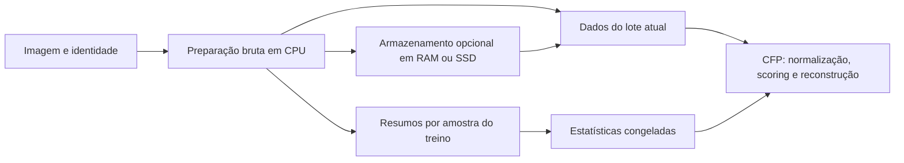

# Plano de implementação do cache da CFP na MTLearn

Data: 2026-09-09. Estado: P0–P6 concluídas no escopo aprovado. Evidências nos relatórios da [P0](cfp-cache/p0/README.md), [P1](cfp-cache/p1/README.md), [P2](cfp-cache/p2/README.md), [P3](cfp-cache/p3/README.md), [P4](cfp-cache/p4/README.md), [P5](cfp-cache/p5/README.md) e [P6](cfp-cache/p6/README.md).

## 1. Objetivo e resultado esperado

Permitir treinar e avaliar a `ConnectedFilterPreprocessingLayer` com muitas imagens em resolução original, sem manter os dados morfológicos de todo o dataset em RAM ou no acelerador. A política de armazenamento deve alterar o custo de execução, preservando a operação matemática, as estatísticas de normalização e os gradientes dentro das tolerâncias de validação.

O caso de integração é o notebook `CFP_linear_vs_mlp_scoring_205_SA_L3D14M3_segmentation.ipynb`, com entradas em `enhancement` e máscaras em `frag_component`. Existem 2.041 pares de 2.748 × 2.748 pixels. A mesma preparação deve servir aos scorers linear e MLP.

A entrega compreende preparação temporária, RAM limitada por bytes, armazenamento local em SSD, retomada, preparação paralela em CPU, documentação e adaptação do notebook para métricas por lotes. O treinamento completo de 100 épocas não é requisito para concluir o refatoramento; a integração deve demonstrar execução em resolução original dentro dos recursos medidos.

## 2. Decisões aprovadas e limites do escopo

| ID | Decisão incorporada |
| --- | --- |
| D01 | Preservar APIs públicas e checkpoints existentes, incluindo `build_dataloader_cached` como interface de compatibilidade. Estruturas privadas podem mudar. |
| D02 | Separar preparação morfológica, armazenamento e normalização. Os parâmetros aprendidos permanecem na CFP. |
| D03 | Na nova API, o padrão é preparação sob demanda sem retenção persistente. RAM e SSD exigem configuração explícita. |
| D04 | Persistir topologia, mapa pixel–nó, resíduos e atributos brutos em CPU, independentes do scorer. Normalizar com as estatísticas do modelo ao consumir os dados. |
| D05 | Limitar retenção por bytes. Controlar separadamente processos, tarefas pendentes, filas e memória de trabalho. Uma entrada grande pode ser usada sem admissão no cache. |
| D06 | Ajustar estatísticas apenas no treino, em passagem incremental, mantendo a definição matemática atual. Congelar antes do treinamento e evitar recomputação estatística por época. |
| D07 | Paralelizar por imagem em processos de CPU, após validar a execução sequencial e o armazenamento. |
| D08 | Incluir SSD local e notebook na primeira entrega. Armazenamento remoto e preparação distribuída ficam para outra evolução. |
| D09 | Medir recursos agregados dos processos. CPU e MPS compartilham a memória física do equipamento de referência. |
| D10 | Tratar as entradas do notebook como determinísticas. Registrar identidade da entrada e pré-processamento para invalidar resultados quando os pixels mudarem. |
| D11 | Permitir retomada, identificar gravações incompletas e garantir uma contribuição estatística por amostra lógica. |
| D12 | Validar resultados, gradientes, estatísticas, memória, compartilhamento entre modelos, embaralhamento, retomada, paralelismo e desempenho. |

Ficam fora desta entrega: mudanças nos algoritmos de construção de árvores, regras de reconstrução/backward, definição dos atributos, precisão dos índices, compressão com perdas, novo estimador de variância, particionamento em patches, aumentos aleatórios com reaproveitamento geométrico da árvore, reconstrução distribuída de uma única imagem e reescrita dos experimentos TIP2026 em andamento.

A CFP continua sendo usada como primeira camada. Atualizações dos pesos não invalidam a preparação da imagem fixa. Recortes, transformações de intensidade e mudança de resolução anteriores à CFP podem invalidá-la; embaralhar a ordem de acesso não invalida.

## 3. Diagnóstico inicial e pontos de intervenção

Esta seção conserva o diagnóstico anterior ao refatoramento. Os caminhos são relativos à raiz do repositório; os resultados implementados estão na seção 9.

| Componente existente | Situação antes da P0 | Mudança planejada |
| --- | --- | --- |
| `mtlearn/python/mtlearn/layers/cfp/runtime/tree_payload_provider.py` | Constrói árvore, extrai tensores, atualiza estatísticas, normaliza e transfere para o dispositivo da camada. | Separar produção de dados brutos em CPU do ajuste estatístico, normalização e transferência. |
| `mtlearn/python/mtlearn/layers/cfp/runtime/tree_payload_cache.py` | Dicionário sem orçamento, com atributos brutos e normalizados. | Adaptador legado e armazenamentos explícitos sem retenção, RAM limitada e SSD. |
| `mtlearn/python/mtlearn/layers/cfp/runtime/cached_dataloader_builder.py` | Percorre o dataset para preencher todo o cache e ajustar estatísticas. A construção das árvores é sequencial. | Separar passagem estatística, preparação e adaptação do carregador; preservar chamadas existentes. |
| `mtlearn/python/mtlearn/layers/cfp/runtime/forward_executor.py` | Resolve dados do cache ou calcula temporariamente por amostra. | Consumir um contrato comum de dados preparados e manter temporários apenas durante seu uso. |
| `mtlearn/python/mtlearn/layers/cfp/normalization/attribute_statistics.py` | Já acumula estatísticas, mas calcula momentos/conversões na aplicação da normalização. | Reutilizar acumuladores e preparar constantes congeladas por versão/dispositivo/tipo. |
| `mtlearn/python/mtlearn/layers/cfp/serialization/persistent_state_manager.py` | Persiste parâmetros e estatísticas, sem dados por amostra. | Preservar essa separação e os formatos já aceitos. |
| `mtlearn/python/mtlearn/layers/cfp/runtime/training_sample_inspector.py` | Inspeção ligada aos dados atuais do cache. | Manter a interface pública e permitir inspeção da nova preparação sem retenção adicional permanente. |
| `notebooks/experiments/CFP_linear_vs_mlp_scoring_205_SA_L3D14M3_segmentation.ipynb` | Dois caches independentes e avaliação que concatena respostas e máscaras. | Compartilhar preparação bruta e calcular métricas por lotes. |

Somente `node_of_pixel`, hoje em `int64`, representa cerca de 114,83 GiB para 2.041 imagens. Respostas e máscaras em `float32`, acumuladas para o mesmo conjunto, representam outros 114,83 GiB. São estimativas de tamanho, não medições de pico do processo. Os demais tensores, atributos e temporários acrescentam memória.

A implementação deve permanecer principalmente na camada Python. Os módulos nativos continuam acessados pela fachada `mtlearn.morphology`. Ajustes nos bindings só entram se uma validação demonstrar necessidade concreta; liberar o GIL para adotar threads não faz parte do caminho inicial por processos.

## 4. Arquitetura e contratos aprovados

A implementação foi incremental. P1–P4 disponibilizam `PreparedMorphology`, `PreparedBatch`, `CFPPreprocessor.from_layer`/`prepare_image`/`prepare_batch`/`prepare`, `fit_stats`, `get_stats`, `set_stats`, `get_statistics_contract`, `StatisticsSnapshot`, `forward_prepared`, `NullStore`, `MemoryStore`, `DiskStore`, manifesto, `PreparationResult`, `PreparedDataset` e `collate_prepared`. A P4 acrescentou processos paralelos; a P5 integrou o notebook; a P6 concluiu documentação, empacotamento e regressão.



### 4.1 Dados preparados

`PreparedMorphology` representa uma imagem/canal/árvore e contém:

- configuração canônica da árvore, identidade da entrada, forma espacial e versão do formato;
- `residues`, `tpre`, `tpost`, `parent`, `node_of_pixel`, ordens de percurso e `num_times`, preservando as convenções atuais;
- atributos brutos e sua ordem/identificação explícita;
- tipos numéricos, tamanhos, informações de integridade e contabilização dos storages.

O objeto não contém labels, parâmetros treináveis, scores, grafo autograd nem atributos normalizados persistentes. Os tensores brutos são tratados como somente leitura. Diferentes scorers podem compartilhar o mesmo objeto se seus contratos de árvore e atributos forem compatíveis.

`PreparedBatch` reúne as amostras necessárias ao lote e valida canais, formas e configurações. A saída mantém `(B, C * num_specs, H, W)` e a ordenação atual por canal e depois por spec. Como na API atual, um lote denso exige dimensões espaciais compatíveis; imagens de tamanhos diferentes usam lotes separados ou tamanho de lote 1.

O primeiro formato mantém os tipos atuais: índices de topologia em `int64`, resíduos em `float32` e atributos no `attribute_dtype` configurado. Não alterar quantização, conectividade, ownership de pixels, ordenação dos nós ou precisão para reduzir memória nesta etapa.

### 4.2 Superfície pública

| Entrada pública | Contrato |
| --- | --- |
| `cfp.fit_stats(loader)` | Consumir uma passagem finita do treino, validar entradas, ajustar as estatísticas e congelá-las, sem preencher um cache completo. |
| `cfp.forward_prepared(batch)` | Aplicar a CFP a dados preparados compatíveis, sem reconstruir a árvore. |
| `cfp.set_stats(snapshot)` | Validar e instalar uma fotografia imutável das estatísticas; invalidar apenas constantes/normalizações derivadas. |
| `CFPPreprocessor.from_layer(cfp)` | Extrair somente contratos morfológicos e de atributos; não copiar pesos, acelerador ou estado de treino. |
| `preprocessor.prepare(source, store=..., collect_stats=..., num_workers=..., max_in_flight=...)` | Preparar uma fonte finita, retornar manifesto e, quando solicitado, estatísticas do treino. Com SSD, construir, resumir e gravar na mesma passagem. |
| `PreparedDataset` e função de colagem | Expor dados preparados e targets ao `DataLoader`, preservando ordem escolhida pelo sampler e identidade estável. |
| `NullStore`, `MemoryStore`, `DiskStore` | Resolver entradas sem retenção, em RAM limitada ou em SSD com retenção limitada em RAM. |
| `store.info()` | Informar bytes residentes, tamanho em disco, entradas, acertos, falhas, descartes e entradas grandes não admitidas. |

`cfp(images)` continua existindo e usa preparação temporária quando não recebe a forma legada com índices. Ele não ajusta estatísticas durante o treino. Modos estatísticos continuam exigindo ajuste ou carregamento prévio; `scale_mode="none"` mantém sua semântica explícita atual.

O resultado de `prepare` deve ser um objeto leve com referências ao manifesto e às estatísticas, não uma lista de todos os tensores. No modo sem retenção, os dados podem precisar ser reconstruídos nas passagens seguintes. Esse custo deve aparecer na documentação e nas medições.

Usar `mtlearn.layers.cfp` como namespace agregado dos novos componentes públicos. Manter uma classe pública por arquivo e apoiar-se em `TreeSpec`, `FeatureSpec` e nos normalizadores existentes. Pacotes introduzidos: `cfp/preparation/` e `cfp/storage/`; o runtime conserva execução, inspeção e reconstrução.

### 4.3 Compatibilidade e migração

- Preservar assinaturas aceitas e forma de retorno de `build_dataloader_cached` e `build_dataloader_cached_fixed_stats`, inclusive `((x, idx), y)`, offsets, política legada de ordem e estatísticas fixas no teste.
- A via legada explicitamente solicitada continua disponível na primeira versão, inclusive seu comportamento de pré-carregamento. O padrão sem retenção se aplica à nova API; não alterar silenciosamente o consumo de recursos das chamadas antigas.
- Preservar `save_stats`, `load_stats`, `get_config`, `from_config`, contratos, helpers de checkpoint e nomes de parâmetros, incluindo `_weights` e `_biases`.
- Não colocar caminhos de SSD, limites de RAM ou processos no contrato matemático de inferência nem no `state_dict`.
- Preservar `cached_sample_count()` para a via legada. Na nova via, `store.info()` distingue entradas no SSD de entradas residentes em RAM.
- Adaptar testes que acessam estruturas privadas, mantendo as verificações do comportamento público.
- Preservar compatibilidade de `predict`, `inspect_training_sample`, constraints, regularizadores e `CFPContext`. Considerar um consumo preparado de regularização para reutilizar o mesmo lote sem nova construção.
- Checkpoints existentes não passam a exigir um SSD ou manifesto de preparação para inferência.

## 5. Identidade e validade das entradas

A chave física deve considerar o conteúdo efetivamente entregue à morfologia depois da conversão canônica atual para `uint8`, forma espacial, configuração da árvore, atributos, tipos e versão do formato/semântica do backend. Parâmetros do scorer, labels e divisão treino/teste não fazem parte do conteúdo morfológico.

Separar identidade lógica da amostra de identidade física do conteúdo. Duas amostras distintas com pixels iguais podem compartilhar armazenamento, mas ambas devem contribuir para as estatísticas quando ambas pertencem ao treino. Uma repetição de tarefa da mesma amostra durante retomada não pode contribuir novamente.

Para fontes determinísticas em disco, o manifesto registra a versão da fonte e do pré-processamento e os fingerprints calculados na preparação. A abertura verifica a compatibilidade do manifesto; uma imagem modificada exige revalidação de conteúdo. Nome de arquivo, índice, tamanho ou data de alteração isolados não são prova de igualdade dos pixels.

Para tensores arbitrários com cache explícito, calcular a identidade dos pixels canônicos ou exigir um contrato documentado de versão imutável da entrada. O caminho padrão sem retenção não exige hashing para reutilização. Transformações aleatórias podem usar novas identidades ou execução temporária; não presumir que a primeira camada recebe sempre os mesmos pixels.

A mudança de 256 × 256 para 2.748 × 2.748 deve obrigatoriamente produzir outra entrada. Embaralhar ou criar `Subset`s não pode associar uma árvore a outra imagem.

## 6. Estatísticas sem gargalo durante o treinamento

### 6.1 Preparação e combinação

Reutilizar a definição atual:

- z-score e clipped z-score: `count`, `sum` e `sumsq`, com acumuladores em CPU `float64` e contagem inteira;
- min-max: mínimos e máximos combináveis, preservando o tipo e as regras existentes;
- `none`: sem ajuste estatístico.

Manter pesos por quantidade de nós, epsilon, clipping, piso, casts e definição da variância. Não substituir pela média das médias das imagens nem introduzir Welford nesta entrega.

Cada tarefa produz um resumo por amostra/canal/árvore/atributo. O coordenador combina os resumos em ordem definida pelo manifesto do treino. Esse mecanismo permite estatísticas equivalentes entre execução sequencial, paralela e retomada, dentro das tolerâncias numéricas estabelecidas.

Persistir resumos junto das entradas permite recombinar estatísticas sem reconstruir árvores quando o conteúdo morfológico está disponível. Identificar a fotografia estatística pelo contrato de normalização e pela composição do treino, incluindo multiplicidade de amostras. Os resumos do teste não entram no ajuste.

`fit_stats` representa um novo ajuste explícito, não uma atualização oculta por falta no cache. Repetir tarefas ou descartar entradas não muda as estatísticas. Preservar separadamente os métodos legados de freeze/unfreeze.

### 6.2 Caminho de treinamento

Após congelar as estatísticas, preparar momentos e constantes por versão estatística, dispositivo e tipo numérico. Preservar a ordem das operações matemáticas atuais, inclusive divisão, para evitar mudanças desnecessárias de arredondamento.

A normalização do lote é temporária. Não recalcular momentos globais, percorrer o dataset ou reconstruir árvores por causa de uma atualização dos pesos. `set_stats`, `load_stats`, restauração de checkpoint e alterações explícitas das estatísticas invalidam os derivados; não invalidam atributos brutos no SSD.

Medir separadamente preparação estatística e aplicação da normalização. Um contador deve demonstrar zero atualizações das estatísticas durante treino e avaliação com snapshot congelado. Linear e MLP recebem o mesmo snapshot validado quando compartilham treino, árvore e atributos.

## 7. Armazenamento, memória e ciclo de vida

### 7.1 RAM limitada e execução temporária

`MemoryStore` usa LRU com orçamento em bytes. Contabilizar storages únicos para não somar duas vezes views que compartilham memória. Reportar separadamente overhead conhecido e memória medida do processo.

Uma entrada maior que o orçamento não é admitida; ela pode ser processada temporariamente se a memória de trabalho permitir. O retorno de uma entrada ao consumidor mantém uma referência válida mesmo se o armazenamento remover sua própria referência.

Os tensores necessários ao backward não podem ser alterados, reutilizados como buffers de outra amostra ou liberados prematuramente. Remover uma entrada do LRU não implica que sua memória já foi devolvida: o grafo autograd pode mantê-la viva. Distinguir bytes retidos pelo cache de bytes ativos dos consumidores.

A memória total aproximada inclui: processo principal + processos de preparação + tarefas/filas + cache residente + lote ativo + tensores do autograd + temporários nativos/dispositivo. O limite de cache é um limite verificável de retenção, não um limite rígido de RSS ou do allocator do acelerador.

Para N imagens, p pixels, m nós e a atributos por imagem, os buffers brutos têm tamanho da ordem de O(p + m*a), além de O(m) de topologia. O cache completo cresce como O(N*(p + m*a)); a nova execução deve reter somente o orçamento K e os dados ativos de um número limitado de tarefas/lotes. Metadados compactos podem crescer com N, mas o manifesto deve ser consultado incrementalmente e não reter todos os payloads.

Transferir ao dispositivo apenas dados em uso. Não oferecer cache persistente de todo o dataset em CUDA/MPS nesta entrega. No MPS, CPU e GPU disputam a mesma memória física.

### 7.2 SSD e retomada

Começar com arquivos de tensores CPU por entrada e manifesto em SQLite, usando dependências já disponíveis. A serialização deve conter tensores e tipos primitivos, sem objetos vivos do backend; usar leitura restrita e `map_location="cpu"`. Avaliar `mmap=True` quando compatível com o formato. Leitura mapeada não representa um limite rígido do page cache do sistema.

Um processo coordenador é o único escritor do manifesto. Trabalhadores gravam arquivos temporários únicos, no mesmo filesystem de destino; o arquivo concluído é publicado atomicamente e registrado após validação. O retorno da tarefa contém referência e metadados pequenos. Limitar também número de arquivos abertos e referências a mapeamentos.

Estados mínimos: ausente, em preparação, válido e falhou. Em retomada, verificar formato, identidade, tamanhos, integridade e existência do arquivo. Resolver o intervalo entre publicação e registro: entradas completas órfãs podem ser verificadas e registradas; arquivos parciais não contam como concluídos.

O manifesto impõe unicidade da contribuição por amostra lógica e contrato estatístico. Reconstituir os acumuladores a partir dos resumos únicos do treino evita depender de uma soma parcial não transacional. Permitir cancelamento entre tarefas e guardar progresso válido.

Definir cota de SSD e comportamento ao atingir a cota. Na primeira implementação de preparação persistente, interromper novas gravações com diagnóstico e retomada possíveis; não apagar silenciosamente entradas válidas. RAM limitada continua usando LRU. Políticas adicionais de remoção automática em disco podem ser acrescentadas depois.

Não presumir que o dataset completo caberá no SSD: estimar o tamanho a partir de algumas imagens antes da preparação integral. Um miss no consumo sob demanda pode reconstruir uma entrada compatível sem alterar as estatísticas congeladas.

## 8. Preparação paralela

A unidade de trabalho é uma imagem, contendo todos os canais e árvores necessários à configuração. Dentro da imagem, reutilizar cada árvore para os atributos solicitados. Não enviar a camada CFP, parâmetros ou estado de acelerador aos trabalhadores.

Usar processos CPU com contexto local `spawn`, funções importáveis da biblioteca e limites explícitos de concorrência. Não alterar globalmente o método de multiprocessing da aplicação. O número de threads PyTorch/OpenMP/OpenCV deve ser configurado no processo trabalhador para evitar multiplicação de threads.

Fontes em disco podem fornecer descritores serializáveis e leitura local ao trabalhador. Para datasets definidos no notebook ou fontes não serializáveis, oferecer execução sequencial e/ou produção das entradas no processo principal com fila limitada. Não assumir que uma classe definida em uma célula será importável por `spawn`.

Não combinar inadvertidamente um pool de preparação com outro conjunto irrestrito de workers do `DataLoader`. Separar leitura, preparação e treinamento e documentar qual componente possui cada processo.

Limitar `num_workers`, `max_in_flight`, filas e quantidade de dados decodificados antecipadamente. Não acumular futures ou resultados grandes de todo o dataset. O coordenador combina somente resumos e referências; a ordem de conclusão pode variar sem alterar a identidade dos resultados.

Os trabalhadores da preparação para SSD não atualizam normalizadores compartilhados e não fazem transferências CUDA/MPS. Aumentar a concorrência somente após medir o pico por tarefa e a vazão do SSD. Uma única imagem que não caiba na memória de trabalho continua sendo uma limitação, mesmo com cache em disco.

## 9. Sequência de implementação

Cada etapa deve resultar em uma alteração revisável. A etapa seguinte começa quando o critério de saída da anterior estiver satisfeito.

### P0 — Referência de correção e orçamento de recursos

- [x] Congelar fixtures pequenas com imagens, configurações, estatísticas, saídas, gradientes e checkpoints produzidos pela versão anterior ao refatoramento.
- [x] Registrar import real de `mtlearn`, extensão nativa, PyTorch, backend, dtype, seed e hardware. O ambiente local possui instalações editáveis de outros checkouts; verificar o checkout efetivamente importado.
- [x] Medir uma imagem representativa por vez, sem preencher o dataset inteiro. Separar leitura, construção, atributos, normalização, transferência, forward e backward.
- [x] Estimar tamanho persistido e pico de preparação para algumas imagens espaçadas no dataset; calcular cota de SSD e margem de memória antes da execução integral.
- [x] Registrar o estado da máquina como observação datada, não como constante da biblioteca.

Saída concluída: [baseline e perfil de recursos](cfp-cache/p0/README.md), com 242 testes aprovados, três falhas esperadas de restauração MPS e quatro medições isoladas em resolução original. Projeção média bruta de 476,71 GiB; o orçamento conservador para persistência integral excede o espaço livre observado. O cache legado completo não foi executado.

### P1 — Preparação bruta e estatísticas independentes

- [x] Criar `PreparedMorphology`, validação do contrato e contabilização dos tensores.
- [x] Extrair preparação CPU de `TreePayloadProvider`, conservando o caminho legado por adaptação.
- [x] Introduzir `fit_stats` incremental, snapshots e combinação de resumos.
- [x] Preparar constantes estatísticas por versão/dispositivo/dtype.
- [x] Preservar formatos de `save_stats`/`load_stats` e estado de checkpoints existentes, incluindo a correção da restauração MPS identificada na P0: momentos `float64` permanecem em CPU.

Saída concluída: [ajuste sem retenção e estatísticas independentes](cfp-cache/p1/README.md), com 352 testes aprovados e restauração MPS corrigida. Ensaio final de três imagens originais: 64,77 s, pico RSS de 1,11 GiB e zero amostras no cache. Testes proíbem atualizações/reduções estatísticas e recálculo de momentos durante o treino congelado.

### P2 — Consumo preparado e RAM limitada

- [x] Introduzir `PreparedBatch`, `forward_prepared`, adaptação de contexto, inspeção, predição e regularização.
- [x] Implementar `NullStore` e `MemoryStore` com LRU em bytes, entradas grandes não admitidas e métricas de retenção/uso ativo.
- [x] Transferir e normalizar somente dados do lote ativo, preservando referências até o backward.
- [x] Integrar os adaptadores legados e preservar API, contagem e checkpoints.
- [x] Permitir que linear e MLP consumam a mesma preparação imutável sem compartilhar parâmetros.

Saída concluída: [consumo preparado e RAM limitada](cfp-cache/p2/README.md), com 446 testes aprovados, incluindo 94 novos casos. Resultados e gradientes equivalentes às fixtures P0 em CPU/MPS; descarte após forward preserva backward. Ensaio CPU em três imagens originais com cache de 256 MiB: pico RSS de 1,278 GiB, três preparações, três acertos e dois descartes LRU. Ensaio de uma imagem original em MPS também aprovado. Zero atualizações estatísticas durante consumo; identidades RAM consideram pixels canônicos e configuração, mantendo identidades persistentes para a P3.

### P3 — SSD, identidade e retomada

- [x] Implementar fingerprints, formato versionado, `DiskStore`, manifesto e leitura sob demanda.
- [x] Implementar gravação atômica, cota, cancelamento, validação e recuperação dos intervalos de falha.
- [x] Persistir resumos por amostra e combinar estatísticas sem reconstrução adicional das árvores já preparadas.
- [x] Implementar `PreparedDataset`/colagem com IDs estáveis, `Subset` e sampler explícito.
- [x] Garantir reutilização entre modelos e isolamento entre dados brutos e snapshots estatísticos.

Saída concluída: [SSD, identidade e retomada](cfp-cache/p3/README.md), com 523 testes aprovados, incluindo 77 novos casos. Cancelamento e encerramento abrupto de processo, órfãos, corrupção, cota e contribuições transacionais foram validados. Ensaio original: cancelamento após uma imagem, retomada de somente duas restantes, estatísticas equivalentes à P1 e reabertura CPU/MPS sem novas árvores. Arquivos de tensores: 717.56 MiB sob cota de 1 GiB; leitura CPU de três imagens e forward/backward dos dois scorers em 3.965 s, com retenção RAM desativada.

### P4 — Processos de preparação com filas limitadas

- [x] Implementar tarefas serializáveis e contexto `spawn`, sem inicializar aceleradores nos trabalhadores.
- [x] Aplicar limites de processos, threads internas, tarefas pendentes e buffers.
- [x] Centralizar manifesto e redução estatística em ordem definida.
- [x] Tratar retry, falha, cancelamento e fontes não serializáveis com comportamento documentado.
- [x] Comparar 1 e 2 processos no equipamento de referência; testar 4 somente quando o orçamento medido permitir.

Saída concluída: [processos CPU com filas limitadas](cfp-cache/p4/README.md), com 559 testes aprovados, incluindo 36 novos casos. Retomada, ordem de conclusão, retries, cota compartilhada, cancelamento e morte abrupta de trabalhador/coordenador foram validados. Nas três imagens originais, 1 processo: 59,54 s e pico RSS agregado de 1,695 GiB; 2 processos: 43,18 s e 2,359 GiB, redução de tempo de 27,5%. Todos os tensores coincidem com a P3 e as estatísticas com a P1; retomadas abaixo de 0,8 s não criaram processos. Quatro processos não executados por excederem a projeção do orçamento de 4 GiB.

### P5 — Notebook e avaliação por lotes

- [x] Adaptar somente o notebook `205_SA_L3D14M3` à preparação compartilhada, ao SSD e aos snapshots do treino.
- [x] Manter o notebook original de screws e os hiperparâmetros, split, máscaras, quantização, inicialização e regra de calibração.
- [x] Substituir `collect_responses_and_targets` por acúmulo de métricas/losses por lotes e manter apenas poucas amostras para gráficos.
- [x] Para a grade de limiares, acumular TP/FP/FN/TN por limiar em blocos limitados. Não criar um tensor com dimensões dataset × limiares × pixels.
- [x] Preservar `prediction >= threshold`, ordem da grade e desempate atual, calculando o limiar apenas no treino e aplicando-o ao teste.
- [x] Preservar média de Dice por imagem e média de BCE ponderada por pixels, inclusive último lote menor. A normalização da resposta continua por imagem.
- [x] Executar uma época curta em resolução original para os dois scorers, conforme o orçamento definido em P0, e registrar resultados como teste de integração.

Saída concluída: [notebook e avaliação por lotes](cfp-cache/p5/README.md), com 595 testes aprovados, incluindo 36 novos casos. O notebook específico usa SSD compartilhado e snapshots do treino; scripts e testes verificam equivalência com a avaliação concatenada e com uma época legada em dados pequenos. A cópia de validação executou integralmente três imagens de 2748 × 2748, uma época para linear/MLP em MPS, em 96,07 s; pico RSS agregado de 1,664 GiB, sem representar todo o uso de memória do driver MPS. Zero reconstruções e atualizações estatísticas no treino/avaliação. O notebook de screws permaneceu intacto, e as 100 épocas com a seleção integral não foram executadas.

### P6 — Documentação, regressão e estabilização

- [x] Atualizar arquitetura, guia da CFP, referência pública e exemplos de migração.
- [x] Documentar propriedade dos tensores, lifecycle do cache, invalidação, desempenho, cotas, processos e diferença entre memória retida e ativa.
- [x] Executar a suíte relevante de regressão e validar pacotes/imports com os novos módulos.
- [x] Publicar o relatório de correção, uso de recursos e desempenho, incluindo verificações não disponíveis no hardware local.
- [x] Confirmar que checkpoints antigos funcionam sem acesso ao armazenamento de preparação.

Saída concluída: [documentação, distribuição e regressão final](cfp-cache/p6/README.md), com 619 testes aprovados, incluindo 19 gradchecks e 24 novos casos de checkpoints sem armazenamento de preparação. Wheel construído a partir do sdist, instalado isoladamente e validado com processo CPU e os 24 casos CPU/MPS. Documentação estrita com imports reais e mocks, exemplos executados e conteúdo dos pacotes conferido. Guias existentes receberam apenas alterações relacionadas ao cache. Nenhuma migração obrigatória dos notebooks existentes; limites não executados registrados no relatório final.

## 10. Plano de validação

### 10.1 Base existente

Ampliar os testes existentes, preservando suas responsabilidades:

- `mtlearn/tests/python/test_cfp_cache.py`: cache, entradas válidas, offsets, estatísticas fixas, freeze/unfreeze, refresh, estatísticas e checkpoints.
- `mtlearn/tests/python/test_cfp_deterministic.py`: reconstrução, gradientes, ordenação e equivalência CPU/MPS.
- `mtlearn/tests/python/test_cfp_components.py`: integração de componentes e contratos de contexto.
- `mtlearn/tests/python/test_cfp_validation.py`: validação, contratos, configuração, constraints e regularização.
- `mtlearn/tests/python/test_gradchecks.py`: referências existentes de diferenciabilidade em exemplos pequenos.

Os novos testes ficaram separados em `test_cfp_cache_baseline.py`, `test_cfp_preparation.py`, `test_cfp_prepared_runtime.py`, `test_cfp_disk_cache.py`, `test_cfp_parallel_preparation.py`, `test_cfp_notebook_streaming.py` e `test_cfp_checkpoint_independence.py`. As fixtures P0 permanecem imutáveis.

### 10.2 Matriz de aceitação

| Área | Verificação obrigatória |
| --- | --- |
| Matemática | Mesmos parâmetros/snapshot produzem saídas e gradientes equivalentes em execução direta, RAM, SSD e via legada. |
| Configurações | Linear e MLP; múltiplos canais/specs; max-tree, min-tree e tree of shapes suportados; modos de escala; constraints e regularizadores. |
| Estatísticas | Contagem por nós correta; mistura de amostras com tamanhos diferentes; nenhum dado de teste; nenhum ajuste no treino; resumos sequenciais/paralelos/retomados equivalentes. |
| Identidade | Mudança de pixels, resolução, árvore, atributo, dtype ou versão invalida a entrada; scorer/ordem de leitura não invalidam preparação bruta compatível. |
| Multiplicidade | Amostras lógicas diferentes com conteúdo igual contribuem separadamente; retry da mesma amostra não duplica contribuição. |
| Memória | Bytes retidos nunca ultrapassam o orçamento; views não são contadas duas vezes; entrada grande não admitida continua válida para uso temporário; aumento de N não aumenta retenção de payloads. |
| Autograd | Evicção durante outros forwards não altera tensores ainda necessários ao backward; compartilhar preparação entre scorers não causa mutação ou retenção indefinida. |
| Persistência | Reinício, arquivo incompleto/corrompido/incompatível, cota esgotada, falha antes/depois de publicação e registro, retry e cancelamento. |
| Carregadores | Embaralhamento, `Subset`, offsets legados, lote final menor, IDs estáveis, fontes serializáveis e fallback documentado no notebook. |
| Checkpoints | Carregar fixtures produzidas antes do refatoramento; manter chaves/contratos; inferência sem SSD; estatísticas derivadas atualizadas após restauração. |
| Métricas | F1/IoU, limiar, perdas e desempates equivalentes à coleta integral em dados pequenos, incluindo máscaras vazias e respostas constantes conforme a convenção existente. |
| Recursos | Pico e tempo de preparação, treino e avaliação; soma/observação dos processos; bytes MPS/CUDA quando disponíveis; testes com cold/warm cache. |

Comparar topologia, IDs, máscaras, contagens e conteúdo persistido sem perdas exatamente. Preservar as tolerâncias das referências existentes: testes determinísticos em `float64` usam `rtol=1e-8`, `atol=1e-10`; CPU/MPS usam `rtol=1e-4`, `atol=1e-5`. Para novas comparações em `float32` no mesmo dispositivo, partir de `rtol=1e-5`, `atol=1e-6`, registrando erros absolutos/relativos. Não relaxar tolerâncias para ocultar regressões; casos especiais precisam de justificativa e fixture própria.

A matriz deve rodar em CPU e MPS no equipamento local. CUDA será validado quando houver ambiente disponível, com tolerâncias fundamentadas nas operações existentes e resultado identificado como executado ou pendente. O plano não pressupõe disponibilidade local de CUDA.

### 10.3 Medições de desempenho e memória

Registrar imagens, pixels, nós, atributos, bytes únicos dos payloads, bytes persistidos, cache hit/miss, evicções, entradas não admitidas, tempo por etapa, throughput, RSS/processos, memória ativa e uso do dispositivo. Distinguir tempo de construção, ajuste estatístico, aplicação da normalização, leitura do SSD e treinamento.

Usar 1, 10 e 100 identidades em testes controlados de memória e somente os subconjuntos reais que couberem no orçamento. Não interpretar `cached_bytes` como pico do programa. Limitar mapeamentos e filas também nos casos de cache cheio e SSD lento. Sincronizar o dispositivo nas fronteiras de medição, sem inserir sincronizações de profiling no caminho público de treino.

Um cache LRU em RAM menor que o dataset pode ter poucos acertos em épocas completas; medir isso. Não exigir uma aceleração arbitrária como critério de correção. A preparação paralela é aceita somente com equivalência e comportamento limitado; a recomendação do número de processos depende da medição de ganho e memória.

## 11. Equipamento de referência e perfil inicial

Observações feitas em 2026-09-09: Apple M4, 10 núcleos, 16 GiB de memória unificada; aproximadamente 4 GiB disponíveis na consulta; SSD externo com cerca de 575 GiB livres. Disponibilidade é dinâmica; as observações subsequentes e os limites usados estão nos relatórios de cada etapa.

| Configuração do experimento | Ponto de partida |
| --- | --- |
| Resolução | Original, lote 1. |
| Preparação | 1 processo CPU e 1 thread interna; aumentar após medir o pico. |
| Tarefas em andamento | Limite próximo do número de processos; sem antecipação ampla de imagens. |
| Cache de imagens do notebook | Desativado em resolução original. |
| Retenção morfológica durante preparação | Gravação em SSD e liberação das entradas concluídas. |
| RAM durante treino com SSD | Começar com até 512 MiB de retenção; entradas maiores podem não ser admitidas. |
| Sobreposição de preparação e treino | Desativada no primeiro perfil. |
| Cota de SSD | Definida após medir tamanhos persistidos; preservar margem para uso normal do volume. |

O orçamento do cache deixa espaço para o maior lote, temporários e sistema operacional. Se nem uma imagem couber, registrar o limite com dimensões e estimativa observada; não redimensionar silenciosamente, reduzir atributos ou alterar o método para fazer o teste passar. A biblioteca deve funcionar com orçamentos configuráveis e não incorporar os números desta máquina como padrão universal.

## 12. Execução das verificações e artefatos de entrega

Executar os comandos em um ambiente que importe este checkout e uma extensão nativa compatível. Antes de validar, conferir os caminhos efetivamente importados; `PYTHONPATH` sozinho pode não sobrepor um redirecionador de instalação editável de outro checkout.

Comandos de referência do plano inicial (o comando completo executado e o bootstrap de imports estão no relatório da P6):

```bash
python -m compileall -q mtlearn/python/mtlearn mtlearn/tests/python
PYTHONPATH=mtlearn/python:build/mtlearn/bindings python -m pytest -q -m "not gradcheck" mtlearn/tests/python/test_cfp_cache.py mtlearn/tests/python/test_cfp_components.py mtlearn/tests/python/test_cfp_deterministic.py mtlearn/tests/python/test_cfp_validation.py
PYTHONPATH=mtlearn/python:build/mtlearn/bindings python -m pytest -q -m gradcheck mtlearn/tests/python/test_gradchecks.py
```

A regressão final incluiu todos os novos módulos de testes e os gradchecks. O notebook foi validado na P5; documentação e build do pacote fonte/wheel, na P6. Não houve alteração de algoritmos nativos. Benchmarks e artefatos permaneceram fora do caminho público da biblioteca.

Entregáveis finais:

- APIs e componentes novos com interfaces legadas funcionais;
- testes e fixtures de compatibilidade, memória e retomada;
- notebook adaptado e validado em resolução original;
- guia de uso/migração e atualização do mapa de arquitetura;
- relatório com equivalência numérica, custos, orçamento escolhido e limitações verificadas.

Este arquivo conserva as decisões e os critérios do plano, com a execução P0–P6 concluída e vinculada aos relatórios. A conclusão não inclui o treinamento integral, conforme o objetivo aprovado.

## Referências

- [Arquitetura atual da CFP](cfp-architecture.md)
- [Guia atual da CFP](source/guides/connected-filter-preprocessing.md)
- [Desenvolvimento e validação](development.md)
- [Notebook de integração](../notebooks/experiments/CFP_linear_vs_mlp_scoring_205_SA_L3D14M3_segmentation.ipynb)
- [PyTorch: carregamento e mmap](https://docs.pytorch.org/docs/2.10/generated/torch.load.html)
- [PyTorch: boas práticas de multiprocessing](https://docs.pytorch.org/docs/2.10/notes/multiprocessing.html)
- [PyTorch: conjunto de trabalho recomendado para MPS](https://docs.pytorch.org/docs/2.10/generated/torch.mps.recommended_max_memory.html)
