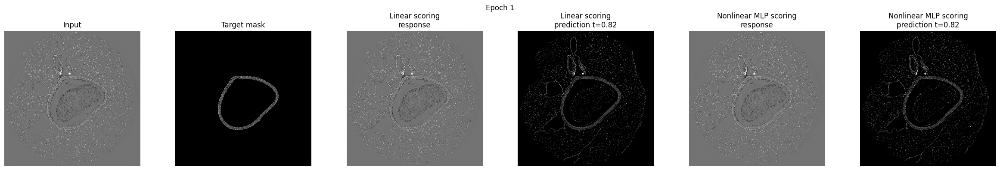

# CFP cache — resultado da etapa P5

Data: 2026-09-09. **P5 concluída; P6 pendente.**

O [notebook de 205_SA_L3D14M3](../../../notebooks/experiments/CFP_linear_vs_mlp_scoring_205_SA_L3D14M3_segmentation.ipynb) agora usa uma preparação bruta compartilhada em SSD e avalia respostas em lotes, com contagens em blocos. Ele mantém a resolução original por padrão e não concatena respostas/máscaras do dataset para selecionar o limiar ou calcular as métricas.

**595 testes aprovados**, incluindo **36 novos testes da P5**. Uma [cópia de validação executada](runs/original_mps/executed.ipynb) completou todas as **13 células de código**, incluindo as três células diagnósticas, com três imagens originais e uma época para cada scorer em MPS. Houve gradientes finitos, atualização de parâmetros e **zero reconstruções de árvores, reduções ou atualizações de estatísticas durante treino/avaliação**.

## Mudanças no experimento

Somente o notebook específico de `205_SA_L3D14M3` foi adaptado. O notebook original de screws foi conferido por SHA-256 e permanece intacto. A biblioteca e o backend não foram alterados nesta etapa; o código usa as APIs da P1–P4.

A preparação é feita uma vez por fonte/contrato, com manifesto de treino e manifesto de teste, IDs estáveis e configuração explícita de SSD/processos. Os dois scorers recebem o mesmo snapshot estatístico calculado exclusivamente no treino. Após a preparação, seus processos e o writer fecham; o treino abre um leitor somente leitura e usa `PreparedDataset`/`collate_prepared`.

Os parâmetros novos controlam armazenamento e avaliação: diretório de cache, versão, cotas, trabalhadores, fila e tamanho dos blocos. A configuração científica anterior foi preservada: seed 42, seleção opcional antes do split, split aleatório 70/30, pareamento numérico, máscaras não invertidas, quantização, atributos, árvore, scorers, learning rate, Adam, clipping, losses, grade de limiares e 100 épocas por padrão.

O carregador legado de cache desativava shuffle, apesar do carregador de entrada solicitar embaralhamento. A nova versão preserva essa **ordem efetiva sequencial**. Cada uma das duas passagens antigas pelo DataLoader também consumia um sorteio de seed CPU antes de `init_identity`; esses sorteios foram preservados para manter a inicialização aleatória de saída do MLP. A equivalência foi verificada contra o fluxo antigo real, com tamanho de lote 1 e 2, incluindo a atualização de parâmetros após uma época.

O novo `SegmentationAccumulator` armazena somente somas de Dice/BCE, contagens de imagens/pixels e TP/FP/FN/TN em `int64`. Os limiares são comparados em blocos, usando a mesma precisão da resposta CPU e a mesma condição `response >= threshold`. A ordem da grade permanece a anterior; `max` mantém o primeiro candidato quando há empate.

A calibração percorre somente o treino. Depois de selecionar o limiar, o teste calcula métricas nesse limiar e no fixo 0,5. A normalização espacial por imagem, o clipping das probabilidades, os pesos da loss e as fórmulas de F1/IoU não mudaram. As funções diferenciáveis de normalização e loss são sintaticamente idênticas às anteriores.

Dice é acumulado com peso por imagem, e BCE com peso por pixel. Isso preserva a loss da avaliação concatenada dentro de tolerância numérica, inclusive com último lote menor. O campo `train_epoch_loss` agora usa a mesma ponderação; a média anterior das médias dos lotes dava peso excessivo ao lote final menor. A loss de cada atualização do otimizador permanece a mesma. Para o padrão em resolução original, lote 1, essa correção do relatório não altera a ponderação anterior.

As visualizações usam apenas uma imagem preparada de teste para ambos os modelos, independentemente do tamanho do lote de treino. Os gráficos são fechados depois de exibidos. Os tensores de cada passo são liberados antes do próximo carregamento, e o leitor fecha ao final do notebook.

## Uso e cotas

Para um primeiro ensaio no notebook:

```python
MAX_SAMPLES = 3
NUM_EPOCHS = 1
# Manter NUM_ROWS = NUM_COLS = None para resolução original.
```

A configuração padrão continua com `MAX_SAMPLES=None` e 100 épocas. A cota padrão de **4 GiB** é deliberadamente pequena e explícita. Um piloto de uma imagem, reutilizado na preparação, estima o espaço da seleção com margem de 15%; uma seleção acima da cota interrompe a preparação com instrução para ajustar `MAX_SAMPLES` ou o orçamento. A estimativa não substitui a verificação do espaço livre e pode variar entre imagens; o `DiskStore` ainda aplica a cota real durante cada gravação.

Escolher `CACHE_DIR` em um volume com espaço disponível e ajustar `CACHE_MAX_DISK_BYTES` somente após medir. O conjunto completo foi projetado na P0 em cerca de 477 GiB brutos antes de serialização e margens; esta etapa não tentou persistir nem treinar as 2.041 imagens. `CACHE_MAX_RAM_BYTES=0`, um trabalhador e uma entrada em voo são os padrões do notebook. O modo sequencial pode ser escolhido com `PREPARATION_WORKERS=0`.

O fingerprint dos manifestos inclui fonte, IDs/ordem dos splits, pré-processamento e atributos/árvore. `CACHE_VERSION` distingue mudanças intencionais nos pixels sob os mesmos IDs. A biblioteca verifica os pixels efetivos na leitura e na retomada; nomes de arquivo sozinhos não garantem identidade. O reader somente leitura evita reconstruções silenciosas durante a época.

## Limite de memória da avaliação

O padrão usa blocos de **8 limiares × 262.144 pixels**. Uma matriz booleana de comparações ocupa cerca de 2 MiB; as operações de redução e interseção possuem temporários adicionais limitados pelos mesmos blocos. O acumulador de 92 limiares do treino, incluindo a referência fixa, retém apenas **2.944 bytes** de contagens, além de escalares. O teste usa somente dois limiares.

O custo dos dados ativos é O(pixels do lote + bloco de limiares × bloco de pixels + quantidade de limiares), sem multiplicação pelo número de imagens do dataset. Somam-se os dados morfológicos ativos, buffers/autograd, memória do dispositivo, gráficos da única amostra de visualização e caches do sistema operacional. As cotas de retenção e de inputs não são limites de RSS.

## Testes e equivalência

A [validação estruturada](validation.json) e o [XML](validation-tests.xml) registram 595 aprovações, zero falhas, erros ou skips. Os 36 testes novos incluem:

- 24 comparações da grade completa em float32/float64, com lotes 1/2/3/5 e blocos 1/7/100, contra a avaliação concatenada anterior;
- respostas constantes, valores exatamente nos limiares, máscaras vazias/cheias, grade não ordenada e limiares repetidos, preservando desempate e contagens;
- formas espaciais distintas em lotes separados, com média de Dice por imagem e BCE ponderada por pixels;
- 101 atualizações sem retenção de respostas ou targets e sem concatenação, mantendo constante o tamanho das contagens;
- restauração do modo train/eval em sucesso e falha; teste isolado provando que o conjunto de teste não seleciona o limiar;
- parâmetros, dataset, split e funções de loss preservados, além do hash intacto do notebook de screws;
- comparação real entre cache legado e SSD compartilhado para inicialização e uma época, incluindo último lote menor.

As contagens/métricas de limiar são idênticas à referência pequena. A loss acumulada usa tolerância `rtol=1e-6`, `atol=1e-7`, devido à ordem de soma de médias de lotes. A comparação dos parâmetros após uma época usa `rtol=1e-5`, `atol=1e-6`. A referência independente anterior à migração está em [reference/notebook_before_p5.json](reference/notebook_before_p5.json).

Comando completo de regressão executado:

```bash
/opt/anaconda3/bin/python scripts/benchmarks/cfp_cache_p4.py test -- -q mtlearn/tests/python/test_bindings.py mtlearn/tests/python/test_data.py mtlearn/tests/python/test_cfp_preparation.py mtlearn/tests/python/test_cfp_prepared_runtime.py mtlearn/tests/python/test_cfp_disk_cache.py mtlearn/tests/python/test_cfp_parallel_preparation.py mtlearn/tests/python/test_cfp_notebook_streaming.py mtlearn/tests/python/test_cfp_components.py mtlearn/tests/python/test_cfp_deterministic.py mtlearn/tests/python/test_cfp_validation.py mtlearn/tests/python/test_cfp_cache.py mtlearn/tests/python/test_morphology_api.py mtlearn/tests/python/test_gradchecks.py mtlearn/tests/python/test_version.py mtlearn/tests/python/test_cfp_cache_baseline.py --junitxml=docs/cfp-cache/p5/validation-tests.xml
```

Outras verificações concluídas: validação estrutural com `nbformat`, compilação de todas as células de código, ausência de erros no notebook executado, todos os hashes das fixtures P0, hashes da biblioteca importada e revisão visual dos gráficos da época 1 e das curvas finais.

```bash
/opt/anaconda3/bin/python -m compileall -q mtlearn/tests/python/test_cfp_notebook_streaming.py scripts/benchmarks/cfp_cache_p5.py
git diff --check
```

Os testes específicos de notebook são opcionais quando `nbformat` ou os artefatos do checkout não estão presentes, evitando exigir dependências de notebooks de uma instalação mínima da biblioteca. Neste ambiente todos foram executados.

## Ensaio em resolução original

Hardware: Apple M4, 10 CPUs lógicas, 16 GiB de memória unificada; modelo em MPS e preparação em CPU. A seleção reproduzível `MAX_SAMPLES=3` produziu **treino: IDs 1068 e 1316; teste: ID 1000**. Foram usados inputs `enhancement` e máscaras `frag_component` originais de 2748 × 2748, sem redimensionar, com todos os 63 atributos e lote 1.

| Fase | Tempo | Pico RSS agregado observado |
| --- | ---: | ---: |
| shared_preparation | 62.49 s | 1.664 GiB |
| initial_evaluation_and_preview | 12.21 s | 1.065 GiB |
| one_epoch_and_evaluation | 13.25 s | 1.202 GiB |
| results | 0.09 s | 0.613 GiB |

Tempo total do processo de execução: **96.07 s**. Pico RSS agregado: **1.664 GiB**. Memória física disponível mínima: **2.011 GiB**. Os limites de interrupção eram 4 GiB de RSS agregado, 1 GiB mínimo disponível e 900 s; nenhum foi atingido.

A soma do RSS foi amostrada a cada 100 ms sobre o executor, kernel Jupyter e descendentes, incluindo preparação. O supervisor externo não participa da soma; páginas compartilhadas podem ser contadas mais de uma vez e picos menores que o intervalo podem não aparecer. **RSS não inclui todas as alocações do driver MPS e não é uma medição do pico total da memória unificada.** A memória disponível do sistema foi monitorada separadamente.

A preparação gerou três entradas, **739,351,347 bytes (705.10 MiB)** sob cota de 1 GiB. O leitor fez 18 leituras, zero gravações, zero retenção RAM e zero bytes ativos ao final. Após a preparação, chamadas para reconstruir árvores, resumir/mesclar/atualizar estatísticas foram substituídas por falhas diagnósticas; nenhuma ocorreu. As estatísticas instaladas nos dois modelos permaneceram iguais ao snapshot de apenas duas amostras do treino.

Os quatro passos de atualização tiveram normas de gradiente finitas e positivas. Hashes dos parâmetros mudaram para ambos os modelos. As losses de avaliação diminuíram neste ensaio, mas o limiar permaneceu em 0,82 e as métricas binárias foram iguais antes/depois da única época. Esses números verificam o funcionamento da integração; três imagens e uma época não sustentam uma comparação de qualidade ou generalização.

[Trajetória completa](runs/original_mps/trajectory.csv), [split](runs/original_mps/split.csv), [resumo](summary.json), [medições por fase](measurements.csv) e [resultados detalhados](runs/original_mps/result.json) registram as evidências. A cópia executada possui os parâmetros efetivos e outputs; o notebook principal foi salvo sem outputs antigos.



Comando de execução completa do ensaio:

```bash
/opt/anaconda3/bin/python scripts/benchmarks/cfp_cache_p5.py --output docs/cfp-cache/p5/runs/original_mps --cache-dir build/cfp-cache-p5-original --device mps
```

Para repetir, escolher um novo diretório `--output`; o mesmo `--cache-dir` permite reutilizar preparações válidas. O driver executa uma cópia com três amostras, uma época, reporte na época 1, cota de 1 GiB e um trabalhador. Ele fixa o interpretador do kernel, confere imports e aplica somente no kernel/filhos o ajuste necessário à instalação editável local que redirecionava para outro checkout. Esse ajuste não está na biblioteca nem no notebook principal.

Não executados nesta etapa: seleção integral com 100 épocas, CUDA indisponível e ensaio original em Linux/Windows. O notebook foi executado integralmente com os parâmetros diagnósticos descritos; não há células pendentes nessa cópia. A **P6** permanece como próxima etapa para documentação geral e estabilização.
